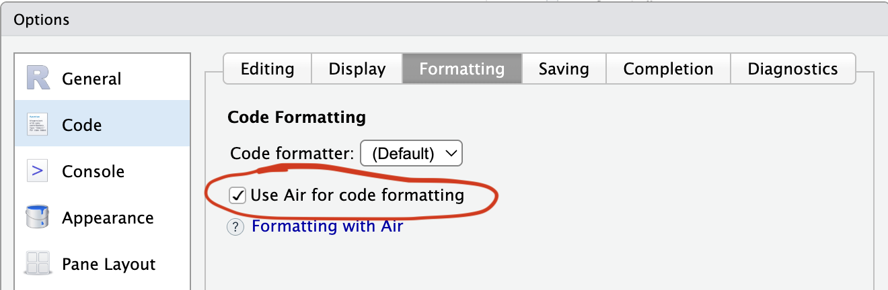

## Git Workflow Review

Make sure we have pushed all of our changes up to this point.

```{bash}
git pull
git push
```

## Pull Request Workflows

***back to slides - PR workflow overview***

The `usethis` PR helpers manage the full lifecycle of a pull request from your R console. We'll use them for everything from here on - including setting up CI and Air.

The helpers you'll use most:

- `pr_init("branch-name")` - create and switch to a new branch
- `pr_push()` - push your branch and open a PR on GitHub
- `pr_pause()` - stash work and return to `main`
- `pr_resume("branch-name")` - return to a branch
- `pr_fetch(123)` - check out someone else's PR locally
- `pr_finish()` - clean up after a PR is merged

## Continuous Integration

### Start a branch

```{r}
pr_init("add-ci")
```

### Add GitHub Actions for R CMD check

```{r}
use_github_action()
```

This creates `.github/workflows/R-CMD-check.yaml` that runs `R CMD check` on multiple platforms whenever you push.

It also adds a "R CMD check" status badge to your README. Look at your README.Rmd badges section, then rebuild, and `check()` locally.

```{r}
build_readme()

check()
```

### Push and open a PR

```{r}
pr_push()
```

This pushes your branch and opens a browser to create the PR. After the PR is opened, watch the Actions tab - CI will run on the PR branch before anything merges to `main`.

### Merge and clean up

Once CI passes and the PR is merged on GitHub:

```{r}
pr_finish()
```

### View your check results

After merging, go to your repo's "Actions" tab to see the workflow run on `main`.

## Setting Up Air

[Air](https://posit-dev.github.io/air/) is a fast R formatter that automatically formats your code every time you save a `.R` file.
It helps you keep your mind focused on the code, and most importantly eases collaboration because it forces a consistent style among you and your collaborators.

### Start a branch

```{r}
pr_init("use-air")
```

### Install Air in your project

```{r}
use_air()
```

In RStudio, change these settings:




[Install the Air command line utility](https://posit-dev.github.io/air/cli.html).
Otherwise, the first time Air is run (i.e., the first time you save a file),
it will be downloaded and installed automatically.

### Format your whole project

In the terminal, run:

```default
air format .
```

### Push and open a PR

```{r}
pr_push()
```

### Merge and clean up

```{r}
pr_finish()
```

## Adding a New Function via PR

Now we'll go through the full PR workflow for a real feature: adding a `biomass_index()` function to `fishr`.

### Start a new feature branch

```{r}
pr_init("add-biomass-function")
```

### Write a new function

```{r}
use_r("biomass")
```

Add a simple biomass calculation function:

```{r}
#' Calculate Biomass Index
#'
#' Calculates biomass index from CPUE and area swept.
#'
#' @param cpue Numeric vector of CPUE values
#' @param area_swept Numeric vector of area swept (e.g., km²)
#'
#' @return A numeric vector of biomass index values
#' @export
#'
#' @examples
#' salmon_cpue <- cpue(catch = 2, effort = 2)
#' biomass_index(cpue = salmon_cpue, area_swept = 5)
biomass_index <- function(cpue, area_swept) {
  cpue * area_swept
}
```

### Document and check

```{r}
document()
load_all()

biomass_index(10, 5)

check()
```

### Push your branch and create a PR

```{r}
pr_push()
```

This pushes your branch and opens a browser to create the PR.

### Fetch and review someone else's PR

While waiting for review, you can check out a collaborator's PR locally:

```{r}
pr_fetch(123) # PR number
```

This lets you run their code, run their tests, and leave an informed review.

When done reviewing, return to your own work:

```{r}
pr_pause() # if you were on a branch
pr_resume("add-biomass-function")
```

### After PR is merged

```{r}
pr_finish()
```
