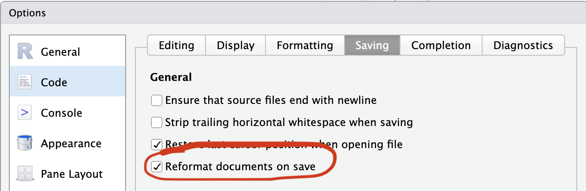

## Outline

1. Git workflow review
2. Pull request workflows with `usethis`
3. Continuous integration with GitHub Actions
4. Code formatting with Air
5. Adding a function via PR

# Git Workflow Review

## Where we left off

Make sure all changes from the fundamentals session are committed and pushed:

```{bash}
git pull
git push
```

::: {.notes}
Quick check - everyone should have a fishr package with `cpue()` and basic documentation, all pushed to GitHub. 
If anyone is behind, now is the time to catch up before we add CI.
:::

## The core loop

Every day of package development follows the same loop:

::: {.incremental}
1. Pull latest changes
2. Make a small, focused change
3. Test that it works
4. Commit with a clear message
5. Push
:::

::: {.fragment}
Pull requests add a **review step** between commit and merge to `main`.
:::

# Pull Request Workflows

## Collaborating

- Git is a *distributed* version control system
- Each collaborator has a full copy of the repository, including its history
- All collaborators can push changes to the remote repository (given they have permission)
- Changes made by collaborators can be pulled into your local repository

## Why pull requests?

```{mermaid}
%%| eval: true
%%| echo: false
%%| label: pull-request
%%| fig-width: 14
%%| file: pull-request.mmd
```

Even when working alone, PRs are valuable:

::: {.incremental}
- Check code runs before it reaches `main`
- You get a diff to review your own/others' work
- Allows efficient code review and discussion
- Allows fearless experimentation
:::

::: {.fragment}
With collaborators, PRs also enable **code review**.
:::

## Steps

1. Create a new branch
2. Make changes, commit, and push the branch to GitHub
3. Open a Pull Request (PR) on GitHub
4. Discuss and review the PR
5. Merge the PR into the main branch
6. Pull the latest changes to your local main branch

## The `usethis` PR helpers

| Function | What it does |
|-|---|
| `pr_init("name")` | Create and switch to a new branch |
| `pr_push()` | Push branch, open PR on GitHub |
| `pr_pull()` | Pull latest changes on that branch from GitHub |
| `pr_merge_main()` | Merge latest changes from `main` into your branch |
| `pr_finish()` | Clean up after merge |
\

::: {.fragment}

### Other useful ones

| Function | What it does |
|---|---|
| `pr_pause()` | Stash work, return to `main` |
| `pr_resume("name")` | Return to a branch |
| `pr_fetch(123)` | Check out someone else's PR |

:::

::: {.notes}
These also help us avoid merge conflicts by doing a lot of "pull before you work" and "pull before you push" automatically.
:::

## Basic PR workflow with `usethis` PR helpers

```{mermaid}
%%| eval: true
%%| echo: false
%%| label: pr-helpers
%%| fig-width: 16
%%| fig-height: 8

---
config:
  theme: base
  themeVariables:
    fontSize: 30px
---

flowchart LR
    A([main]) --> PI["pr_init()"] --> B([Branch])
    B --> C[Write & test]
    C --> PP["pr_push()"] --> D([GitHub PR])
    D --> E{Review}
    E --> C
    E -->|Merged| F([main updated])
    F --> PF["pr_finish()"] --> G([Clean state])

    style A fill:#2d6a4f,color:#fff,stroke:none
    style F fill:#2d6a4f,color:#fff,stroke:none
    style G fill:#2d6a4f,color:#fff,stroke:none
    style B fill:#1d3557,color:#fff,stroke:none
    style D fill:#457b9d,color:#fff,stroke:none
    style E fill:#e63946,color:#fff,stroke:none
    style C fill:#333,color:#fff,stroke:#666
    style PI fill:#f4a261,color:#000,stroke:none
    style PP fill:#f4a261,color:#000,stroke:none
    style PF fill:#f4a261,color:#000,stroke:none
```

Demonstrates the full workflow: <https://usethis.r-lib.org/articles/pr-functions.html>

## Starting a branch

```{r}
usethis::pr_init("my-branch-name")
```

::: {.fragment}
- Creates and checks out the branch immediately
- You are now isolated from `main`
- Branch names: short, descriptive, hyphenated
:::

::: {.notes}
A reader should be able to guess what the PR does from the branch name alone.
:::

## Pushing and opening a PR

```{r}
usethis::pr_push()
```

::: {.fragment}
- Pushes your branch to GitHub
- Opens your browser to the "Create pull request" page
:::

## Writing a good PR description

**Title:** Short, imperative - "Add foofy function"

**Body:**

- What problem does this solve?
- Any design decisions worth explaining?
- Anything reviewers should pay attention to?

## After review and merge

Once the PR is approved and merged on GitHub:

```{r}
usethis::pr_finish()
```

::: {.fragment}
- Switches back to `main`
- Pulls the latest changes (including your merged work)
- Deletes the local feature branch
- Deletes the remote feature branch
:::

## Pausing and resuming

If you need to switch context mid-PR:

```{r}
usethis::pr_pause()                          # return to main
usethis::pr_resume("my-branch-name")         # pick up where you left off
```

::: {.notes}
This is useful when someone asks you to review their PR while you're mid-work, or when you need to make a quick fix to main.
:::

## Reviewing someone else's PR locally

```{r}
usethis::pr_fetch(1)    # check out PR #1 locally
```

::: {.fragment}
Run their code, run their tests, leave an informed review on GitHub.

Once the PR is merged, clean up your local branch and delete the PR branch:

```{r}
usethis::pr_finish()
```
:::

## The full picture

```{mermaid}
%%| eval: true
%%| echo: false
%%| label: pr-helpers-full
%%| fig-width: 16
%%| fig-height: 8

---
config:
  theme: base
  themeVariables:
    fontSize: 20px
---

flowchart LR
    A([main]) --> PI["pr_init()"] --> B([your branch])
    B --> C[Write & test]
    C --> PP["pr_push()"] --> D([GitHub PR])
    D --> E{Review}
    E -->|Changes needed| C
    E -->|Approved & merged| F([main updated])
    F --> PF["pr_finish()"] --> A

    D --> PFetch["pr_fetch()"] --> G([reviewer's local])
    G -->|review & comment| D

    B --> PA["pr_pause()"] --> A
    A --> PRe["pr_resume()"] --> B

    style A fill:#2d6a4f,color:#fff,stroke:none
    style F fill:#2d6a4f,color:#fff,stroke:none
    style B fill:#1d3557,color:#fff,stroke:none
    style G fill:#1d3557,color:#fff,stroke:none
    style D fill:#457b9d,color:#fff,stroke:none
    style E fill:#e63946,color:#fff,stroke:none
    style C fill:#333,color:#fff,stroke:#666
    style PI fill:#f4a261,color:#000,stroke:none
    style PP fill:#f4a261,color:#000,stroke:none
    style PF fill:#f4a261,color:#000,stroke:none
    style PFetch fill:#f4a261,color:#000,stroke:none
    style PA fill:#f4a261,color:#000,stroke:none
    style PRe fill:#f4a261,color:#000,stroke:none
```

Demonstrates the full workflow: <https://usethis.r-lib.org/articles/pr-functions.html>

# Continuous Integration

## Why CI?

Your package works on your machine. But does it work on:

::: {.incremental}
- Windows? macOS? Linux?
- R 4.4? R-devel?
:::

::: {.fragment}
**Continuous Integration** automatically runs checks on every push

- In practice, we’re going to use GitHub Actions, a free workflow automation service included with your GitHub account
:::

## We will add CI via a Pull Request

Create a new branch:

```{r}
usethis::pr_init("add-ci")
```

## Add R CMD check via GitHub Actions

### <https://github.com/r-lib/actions>

\

```{r}
usethis::use_github_action()
```


- `"check-standard"`: Runs `R CMD check` on several platforms when you push
- `"test-coverage"`: Compute test coverage and report at codecov.io 
- And more… (<https://github.com/r-lib/actions/tree/v2/examples>)

::: {.fragment}
Creates `.github/workflows/R-CMD-check.yaml` which runs `R CMD check` on:

- macOS (release R)
- Windows (release R)
- Ubuntu (release, devel, and oldrel R)
:::

## Add a status badge

The action also adds a badge to your `README.Rmd`:

```{r}
devtools::build_readme()
devtools::check()
```

::: {.fragment}
Then push and open the PR:

```{r}
usethis::pr_push()
```

Write a good PR title and description, then submit the PR.

Watch the Actions tab - CI runs on the PR branch before we merge to `main`.
:::

## Viewing CI results

Go to the **Actions** tab on your repo.

Each push triggers a workflow run. 

- ✅ Green checkmark = passing. 
- ❌ Red X = something to fix.

::: {.notes}
Show this live - click into a run and show the output from R CMD check. The output is identical to what you see locally with check(). Getting comfortable reading CI output is a key skill.
:::

Merge the PR on GitHub once CI is passing.

Run `pr_finish()` to clean up your branch after merging.

# Code Formatting with Air

## What is Air?

[Air](https://posit-dev.github.io/air/) is a fast R code formatter - it automatically reformats your code on save.

**Why it matters for collaboration:**

::: {.incremental}
- Eliminates style debates in code review
- Reduces noisy diffs (no more whitespace-only changes)
- Keeps everyone's code consistent without thinking about it
:::

## Start a branch

```{r}
usethis::pr_init("use-air")
```

## Set up Air in your project

```{r}
use_air()
```

In RStudio, change these settings:

{height=250}

{height=250}

Install the Air command line utility: <https://posit-dev.github.io/air/cli.html>

::: {.notes}
Air will be downloaded automatically on first save if you haven't installed the CLI.
:::

## Format your whole project

```default
air format .
```

## Push and merge

```{r}
usethis::pr_push()
```

Review the diff on GitHub - you should see only formatting changes, no functional changes.

## While we wait for CI...

Let's leave this PR and start a new one...

```{r}
pr_pause()
```

Now we're back on `main` and can start a new branch for the next feature.

# Adding a Function via PR

## Start a branch

```{r}
usethis::pr_init("add-biomass-function")
```

## Write the function

```{r}
usethis::use_r("biomass")
```

```{r}
#' Calculate Biomass Index
#'
#' Calculates biomass index from CPUE and area swept.
#'
#' @param cpue Numeric vector of CPUE values
#' @param area_swept Numeric vector of area swept (e.g., km²)
#'
#' @return A numeric vector of biomass index values
#' @export
#'
#' @examples
#' salmon_cpue <- cpue(catch = 2, effort = 2)
#' biomass_index(cpue = salmon_cpue, area_swept = 5)
biomass_index <- function(cpue, area_swept) {
  cpue * area_swept
}
```

## Document and check

```{r}
devtools::document()
devtools::load_all()

biomass_index(10, 5)

devtools::check()
```

Commit when `check()` passes cleanly.

## Push and open a PR

```{r}
pr_push()
```

## Go back to the Air PR

Pause the biomass PR and return to main:
```{r}
pr_pause()
```

. . .

\
Now resume the Air PR:

```{r}
pr_resume() # Choose the Air PR from the menu
```

. . .

\
On Github, Merge the Air PR, then back in RStudio clean up the branch.
```{r}
pr_finish()
```

## Now resume the biomass PR

```{r}
pr_resume("add-biomass-function")
```

. . .

\
Get the latest changes from `main` (including the now-merged Air PR):

```{r}
pr_merge_main()
```

. . .

\
Then push the updated branch:

```{r}
pr_push()
```

. . .

\
On GitHub, review the biomass PR and merge once CI is passing.

. . .

\
Finally, clean up the branch:

```{r}
pr_finish()
```

## Resources

- Happy Git and GitHub for the useR: <https://happygitwithr.com/>
- `usethis::pr_*` helpers: <https://usethis.r-lib.org/articles/pr-functions.html>
- GitHub Actions for R: <https://github.com/r-lib/actions>
- Air code formatter: <https://posit-dev.github.io/air/>
