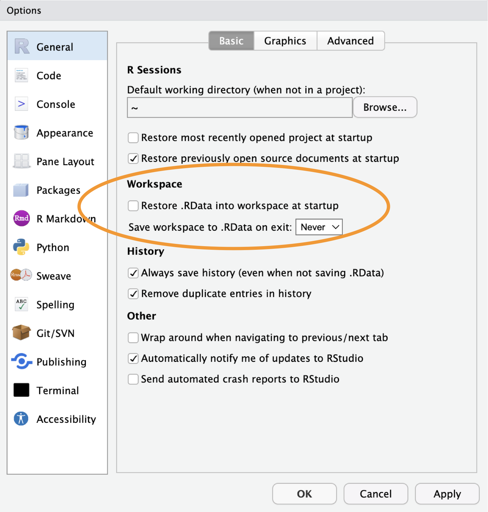
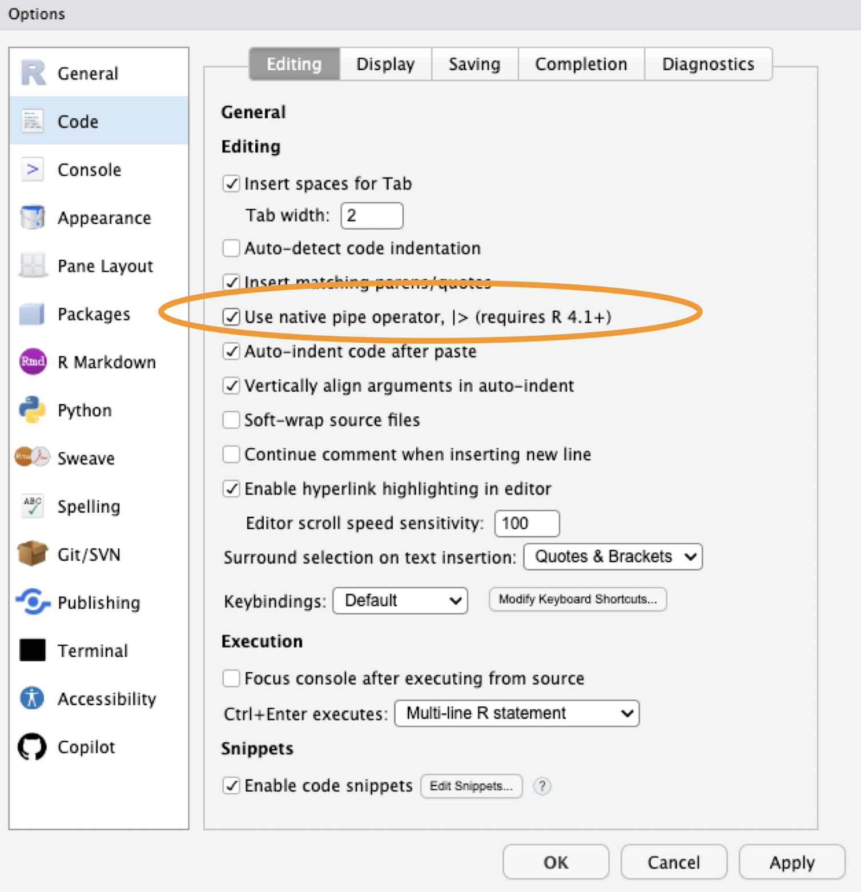
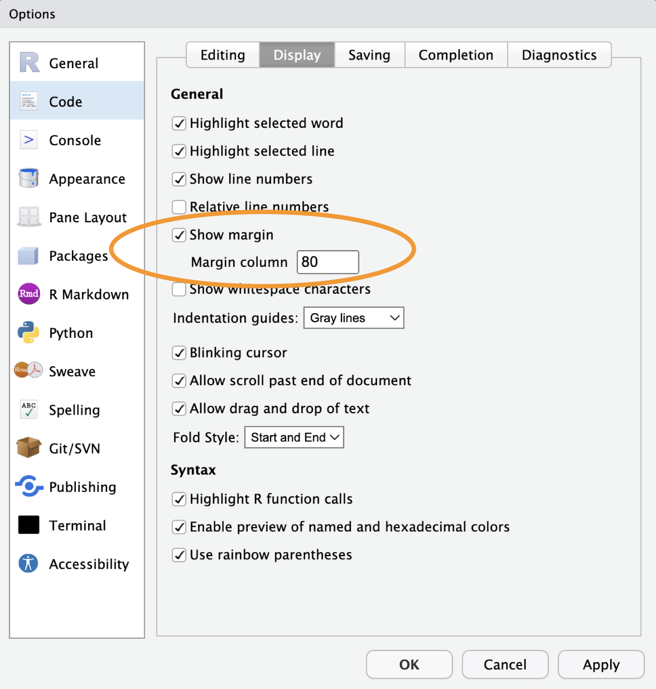
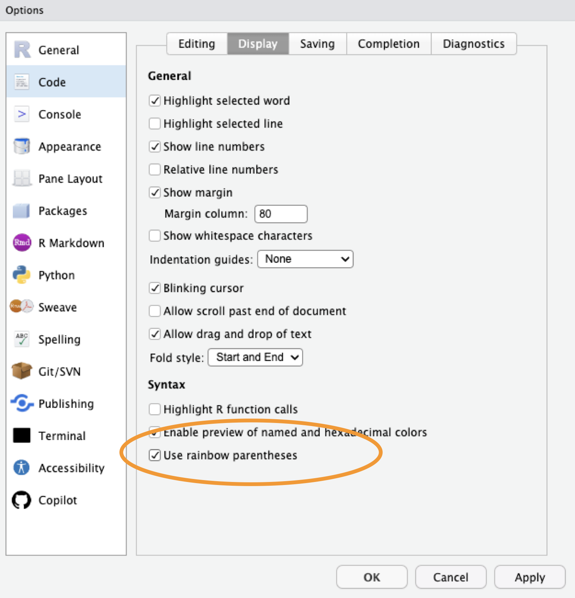
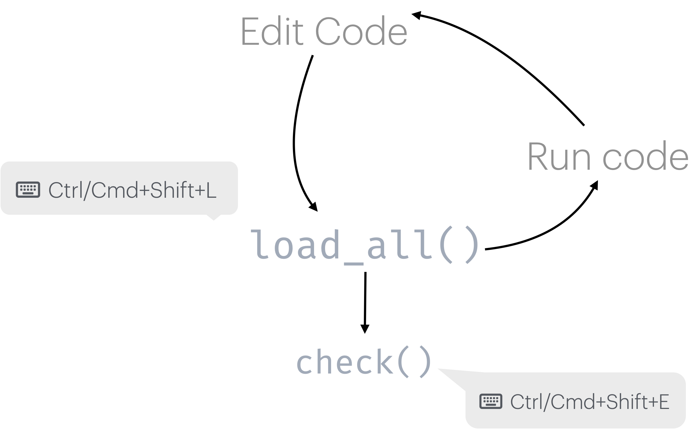
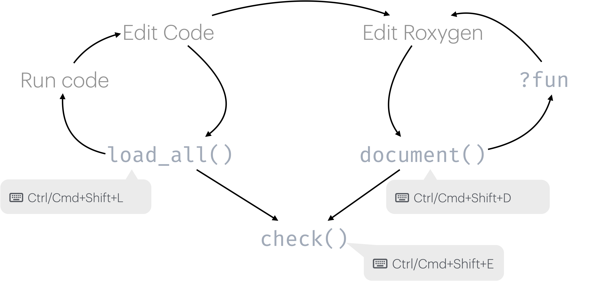

## Outline

1. Why make a package?
2. Lay the foundations
3. Write your first function
4. Documentation basics
5. Common pain points

# R Packages

## Why make a package?

- Reuse your code across projects and share it with others
- Enforce a consistent interface around your work
- Bundle code with documentation and tests
- Distribute software in a reproducible way to:
  - your team
  - the world

## Script vs Package

:::: {.columns}

::: {.column width="50%"}
**Script**

- Copy-paste to reuse across projects and run with `source` or select+run
- Documentation in `#comments`
- Tested less frequently
- Functions mixed with analysis code
:::

::: {.column width="50%"}
**Package**

- install once, `library()` anywhere
- Document in Roxygen comments to enable `?function`
- testthat test suite
- Functions only - clean separation
:::

::::

::: {.notes}
A package is the fundamental unit of shareable R code. Even if you never share it publicly, packaging your own work enforces good habits.
:::

## Package structure and state

### Five forms

| | |
|---:|:---|
| **Source** | Directory of files with specific structure<br>What you interact with as you build a package |
| **Bundle** | Compressed into a single file (.tar.gz) via `devtools::build()` -> R CMD build<br>Vignettes built; files in `.Rbuildignore` left behind |
| **Binary** | Platform-specific compressed file (.tgz, .zip)<br>Made with `devtools::build(binary = TRUE)` → R CMD INSTALL --build |
| **Installed** | Binary package decompressed into a user's library<br>`install.packages()` |
| **In Memory** | Loaded and ready for use in an R session<br>`library()` |
: {tbl-colwidths="[20,80]"}

::: {.notes}
As a developer, you mostly live in the source form. Bundle and binary are intermediate forms you rarely touch directly — devtools handles them. Installed is what users have after `install.packages()`. In memory is what you get after `library()` — this is the only state where you can actually use the package. `load_all()` shortcuts straight from source to in-memory without going through the other forms.
:::


## Package structure

```default
mypackage/
  R/           <- Your R functions
  man/         <- Documentation (auto-generated)
  tests/       <- Tests
  DESCRIPTION  <- Package metadata
  NAMESPACE    <- Exports (auto-generated)
```

## Let's make a package!


:::: {.columns}

::: {.column width="50%"}
**We will**

- Create a simple fishy package 
- Focus on workflows
:::

::: {.column width="50%"}
**We won't**

- Cover every aspect of R package development
:::

::::

# Lay the Foundations

## Configure RStudio

### Tools > Global Options

:::: {.columns}

::: {.column width="50%"}

:::

::: {.column width="50%"}

:::

::::

## Configure RStudio

### Tools > Global Options

:::: {.columns}

::: {.column width="50%"}

:::

::: {.column width="50%"}

:::

::::

## Tools

-   R version \>= `4.4.0` (4.5 strongly recommended)
-   RStudio \>= `2025.09` (2026.01 recommended)
-   R package development toolchain
-   Git
-   GitHub account

### Check required packages

```{r}
all(
  c("devtools", "roxygen2", "testthat", "knitr", "pkgdown", "usethis") %in%
    installed.packages()
)
```

## Create your package

```{r}
library(devtools)
create_package("~/Desktop/fishr")
```

::: {.fragment}
Opens a new RStudio project with the basic package skeleton:

- `R/` - directory for your functions
- `DESCRIPTION` - package metadata
- `NAMESPACE` - exports (managed automatically)
:::

## Use devtools automatically

```{r}
use_devtools()
```

::: {.fragment}
Adds `library(devtools)` to your `.Rprofile` so it is always loaded during development.

Not a package dependency - only for your own workflow.

Note: devtools makes all of usethis available too.
:::

## Confirm git is configured

```{r}
git_sitrep()
dev_sitrep()
```

::: {.fragment}
If git_sitrep warns of a missing username or email:

```{r}
use_git_config(
  user.name = "Your Name",
  user.email = "your.email@example.com"
)
```

If dev_sitrep suggests package updates, do them now.
:::

## Initialize git and connect to GitHub

```{r}
use_git()
```

::: {.fragment}
Then connect to GitHub:

```{r}
use_github()
```

Creates a GitHub repo and pushes your initial commit.
:::

# Write Your First Function

## Create a function file

```{r}
use_r("cpue")
```

::: {.fragment}
Creates `R/cpue.R` and opens it for editing.
:::

## Write the function

`cpue` calculates catch per unit effort - a fundamental metric in fisheries science.

```{r}
cpue <- function(catch, effort, gear_factor = 1) {
  raw_cpue <- catch / effort

  raw_cpue * gear_factor
}
```

## Load and test interactively

### Try your function in the new package

```{r}
load_all()
```

::: {.fragment}
Simulates installing and loading the package - much faster than `install()`.

```{r}
cpue(10, 5)
```

`Ctrl/Cmd+Shift+L` - use this constantly during development.
:::

## Run a full package check

```{r}
check()
```

::: {.fragment}
Runs R CMD check - the same check CRAN runs.

Aim for 0 errors, 0 warnings, 0 notes.
:::

## Package development loop


## Set a license

```{r}
use_mit_license()
```

::: {.fragment}
Adds `LICENSE` and `LICENSE.md` files and updates `DESCRIPTION`.

Other options: `use_gpl3_license()`, `use_ccby_license()`, `use_apache_license()`
:::

## DESCRIPTION file

```default
Package: fishr
Title: Calculate standard catch metrics for fisheries
Version: 0.0.0.9000
Authors@R:
    person("Jane", "Doe",
           email = "jane.doe@something.com",
           role = c("aut", "cre"),
           comment = c(ORCID = "XXXX-XXXX-XXXX-XXXX"))
Description: Provides functions for calculating and analyzing fisheries
    catch data, such as Catch Per Unit Effort (CPUE), a fundamental metric in
    fisheries science.
License: MIT + file LICENSE
Encoding: UTF-8
Roxygen: list(markdown = TRUE)
RoxygenNote: 7.3.2
```

# Documentation

## Add a roxygen block

Insert a template with `Ctrl+Alt+Shift+R` or `Cmd+Option+Shift+R`

```r
#' Calculate Catch Per Unit Effort (CPUE)
#'
#' Calculates CPUE from catch and effort data, with optional gear standardization.
#'
#' @param catch Numeric vector of catch (e.g., kg)
#' @param effort Numeric vector of effort (e.g., hours)
#' @param gear_factor Numeric adjustment for gear standardization (default is 1)
#'
#' @return A numeric vector of CPUE values
#' @export
#'
#' @examples
#' cpue(100, 10)
#' cpue(100, 10, gear_factor = 0.5)
cpue <- function(catch, effort, gear_factor = 1) {
  ...
}
```

## Generate documentation

```{r}
document()
```

::: {.fragment}
- Reads `#'` roxygen2 comments
- Creates `man/cpue.Rd`
- Updates `NAMESPACE`

Preview with:

```{r}
load_all()
?cpue
```

:::

## Package development workflow (Again)


## NAMESPACE

Controls what your package exports and what it imports from other packages.

```default
# Generated by roxygen2: do not edit by hand

export(cpue)
```

::: {.fragment}
- Managed automatically by roxygen2 - never edit by hand
- Use `@export` to export a function
- Use `@importFrom pkg fun` to import from another package
:::

## Package-level documentation

```{r}
use_package_doc()
document()
```

::: {.fragment}
Creates `R/fishr-package.R` with package-level roxygen.

```{r}
load_all()
?fishr
```

:::

## README

```{r}
use_readme_rmd()
```

::: {.fragment}
Creates `README.Rmd`. Edit it, then render to `README.md`:

```{r}
build_readme()
```

`README.md` is what GitHub displays on your repository page.
:::

# Common Pain Points

## `load_all()` vs `install()`

- `load_all()`: during active development - fast, doesn't install. Use this when working *inside* your package project.
- `install()`: when you want to test as a "real" package, *outside* your package project.

## Managing dependencies

- Which functions need `@importFrom`?
- When to use `package::function()` vs importing?
- Dependencies in `NAMESPACE` vs `DESCRIPTION`

::: {.fragment}
Rule of thumb: use `package::function()` in your code, declare the package under `Imports` in `DESCRIPTION` with `use_package("pkg")`.
:::

## Documentation drift

- Keeping roxygen comments in sync with code
- Updating examples when function signatures change

::: {.fragment}
Run `document()` regularly - it is fast and keeps `man/` files current. `check()` will catch documentation that does not match the code.
:::

## Understanding `check()` output

- **Errors**: must fix before releasing
- **Warnings**: should fix before releasing
- **Notes**: review carefully - some are informational

::: {.fragment}
Run `check()` early and often. It is much easier to fix one new problem than ten accumulated ones.
:::

# Your Turn

## Exercise

1. Fill in the `Title` and `Description` fields in `DESCRIPTION`
2. Add a roxygen block above `cpue()` with `@param`, `@return`, `@export`, and `@examples`
3. Run `document()` and verify `?cpue` works
4. Run `check()` and resolve any warnings

::: {.fragment}
**Bonus:** set a default DESCRIPTION via `.Rprofile` so you never have to fill in your name and email again:

```{r}
edit_r_profile()
```

:::
